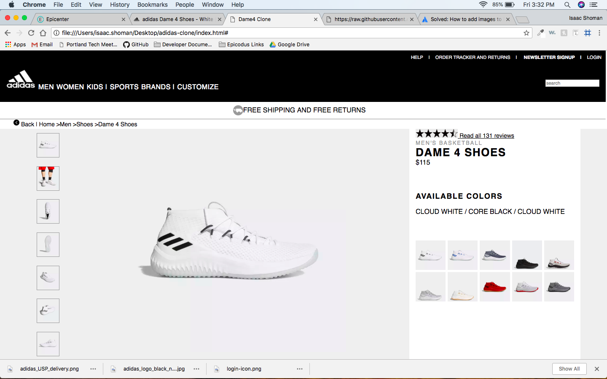

# _Adidas Clone_

#### _Clone of the DAME 4 SHOES page on adidas.com_

#### By _** Isaac Shoman**_

## Description

_Styled and created using only HTML and CSS. The prompt for this project was to clone a webpage that incorporates a grid layout. I chose the adidas page for a pair of basketball shoes and cloned it using Flexbox and CSS Grid. It was a fun experience after working with these layouts for a week. I couldn't clone it exactly as Adidas uses all custom fonts, so I chose a standard front from their font stack._

## Adidas Page

## My Page

## Setup/Installation Requirements

* _Clone Repository to Desktop_
* _Open in Web Browser_
* _No other steps needed_

## Known Bugs

_No known bugs_

## Support and Contact Details

_You may email me at isaac.shoman@gmail.com with any questions or feedback_

## Technologies Used

_Nothing besides basic HTML and CSS was used_

### License

*This website is licensed under an MIT License*

Copyright (c) 2018 **_Isaac Shoman_**
